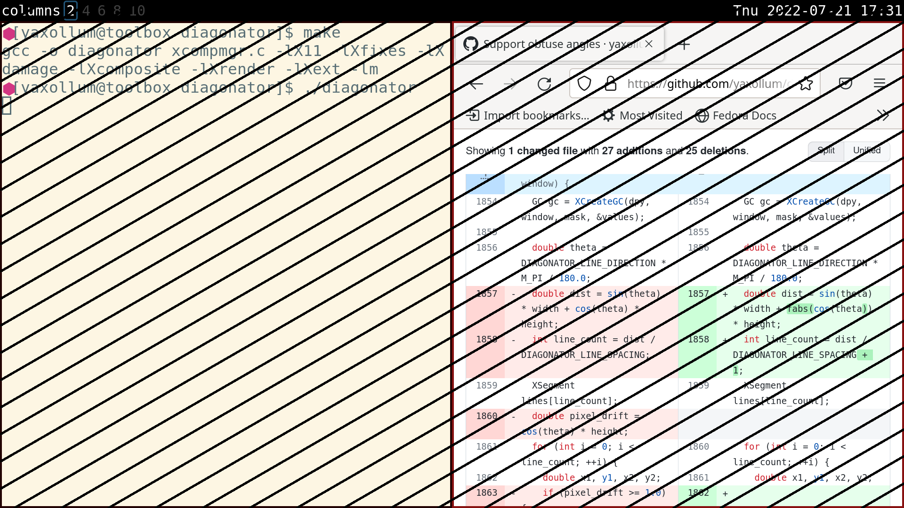

diagonator is an X11 compositor that draws diagonal lines across your screen to make you take a break from your computer.



diagonator is a fork of [xcompmgr](https://gitlab.freedesktop.org/xorg/app/xcompmgr), so in addition to diagonal lines, it supports the same special effects as xcompmgr.

## Build instructions

### Dependencies

diagonator depends on libX11, Xfixes, Xdamage, Xcomposite, Xrender, and Xext. These libraries might be included in your operating system's official repositories. For example, on Fedora, they can be installed with

```
sudo dnf install libX11-devel libXfixes-devel libXdamage-devel libXcomposite-devel libXrender-devel libXext-devel
```

### Building

With the dependencies installed, diagonator can be built with

```
make
```

This will produce an executable binary called `diagonator` in the same directory.

## Usage

To run diagonator with its default options, use

```
./diagonator
```

### Options

To view a full list of supported options (options unique to diagonator as well as options that come with xcompmgr), run

```
./diagonator -h
```

There are multiple options for customizing the appearance of the diagonal lines:

```
--line-direction degrees
    Direction of the lines, counterclockwise from the bottom of the screen.
--line-width pixels
    Width of the lines.
--line-spacing pixels
    Spacing between the lines.
--line-style style
    Style of the lines, as an integer. (0 = LineSolid, 1 = LineOnOffDash, 2 = LineDoubleDash)
```

Additionally, you can configure the margins to make diagonator draw in a custom rectangular area instead of your entire screen (this could be useful if you don't want diagonator to draw over your status bar):

```
--top-margin pixels
--bottom-margin pixels
--left-margin pixels
--right-margin pixels
```
